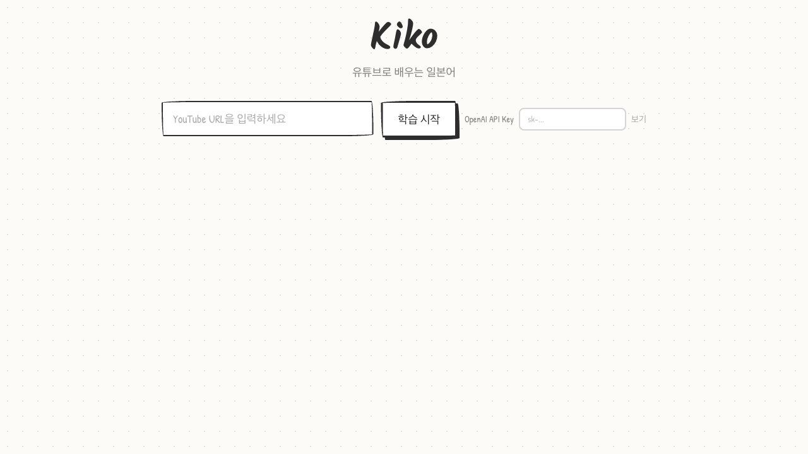
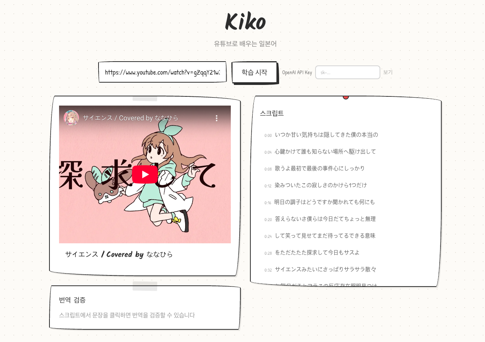
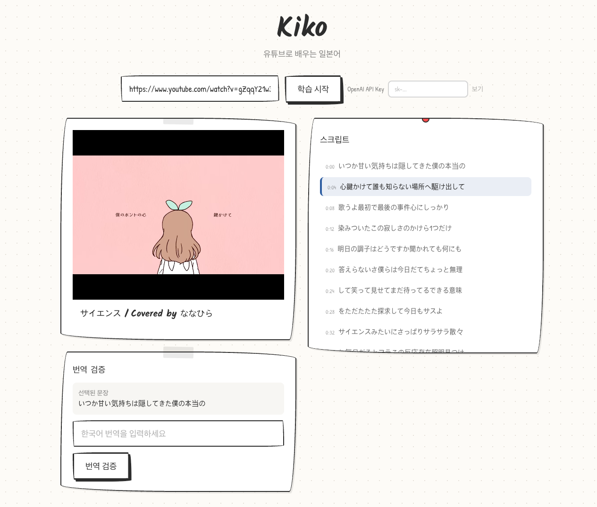
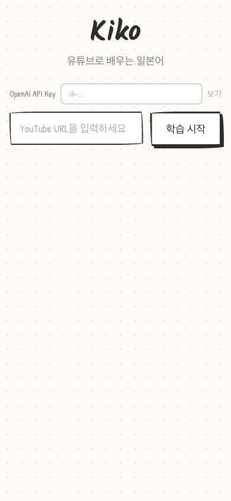

# Kiko - 일본어 학습 플랫폼

YouTube 영상 기반 일본어 학습 MVP. 자막 동기화 + LLM 번역 검증을 한 화면에서 제공합니다.

## 주요 기능

- YouTube 영상 자막 자동 추출 (일본어)
- 영상과 자막 실시간 동기화
- 문장 선택 후 한국어 번역 입력
- OpenAI GPT-4o-mini 기반 번역 검증
- 반응형 디자인 (데스크탑 / 모바일)

## 스크린샷

### 랜딩 페이지


### 자막 표시


### 문장 선택 & 번역 검증


### 모바일 뷰


## Tech Stack

- **Framework**: Next.js 14 (App Router) + TypeScript
- **Styling**: Tailwind CSS (Hand-Drawn 디자인 시스템)
- **Test**: Vitest (단위/통합) + Playwright (E2E)
- **Package Manager**: pnpm
- **API**: YouTube Data API v3, youtube_transcript_api (Python)
- **LLM**: OpenAI API (gpt-4o-mini, 전략 패턴)

## 시작하기

### 사전 요구사항

- Node.js 20+
- pnpm
- Python 3.12+ (`youtube_transcript_api` 패키지)

### 설치

```bash
# 의존성 설치
pnpm install

# Python 패키지 설치
pip install youtube-transcript-api

# 환경변수 설정
cp .env.example .env.local
# YOUTUBE_API_KEY 설정
```

### 실행

```bash
# 개발 서버
pnpm dev

# 프로덕션 빌드
pnpm build && pnpm start
```

### 테스트

```bash
# 단위/통합 테스트
pnpm test

# E2E 테스트
pnpm test:e2e

# 린트
pnpm lint
```

## 프로젝트 구조

```
src/
├── app/
│   ├── page.tsx              # 메인 페이지
│   └── api/
│       ├── youtube/route.ts   # YouTube 자막 API
│       └── verify/route.ts    # 번역 검증 API
├── components/
│   ├── YouTubeInput.tsx       # URL 입력
│   ├── VideoPlayer.tsx        # YouTube 플레이어
│   ├── ScriptPanel.tsx        # 자막 패널
│   ├── VerifyPanel.tsx        # 번역 검증 패널
│   └── ApiKeyInput.tsx        # API Key 입력
├── lib/
│   ├── youtube/               # YouTube API 클라이언트
│   ├── llm/                   # LLM 전략 패턴
│   ├── japanese/              # 일본어 감지
│   └── utils/                 # 유틸리티
└── hooks/                     # 커스텀 훅
```

## CI/CD

- GitHub Actions로 PR 시 자동 테스트 (lint, unit, build, e2e)
- `dev` 브랜치에서 작업 → `main`에 PR
